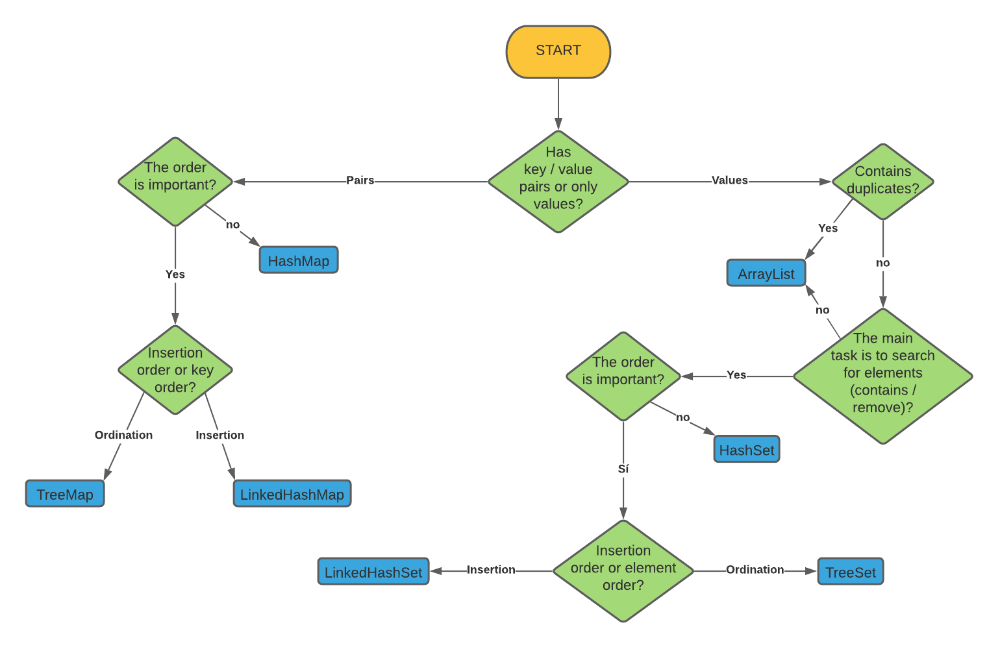

# JavaCollections

## What does Java Collections mean?
> A Collection represents a group of objects known as its elements. The Collection interface is used to pass around collections of objects where maximum generality is desired. For example, by convention all general-purpose collection implementations have a constructor that takes a Collection argument. This constructor, known as a conversion constructor, initializes the new collection to contain all of the elements in the specified collection, whatever the given collection's subinterface or implementation type. In other words, it allows you to convert the collection's type.

## Types
* List
* Set
* Queue
* Deque
* Map



## Collection
Is the general interface to use collections and can manage the basic functions in List, Set and Queue

-----

## List

> Ordered Collection (sometimes called a sequence). Lists may contain duplicate elements. 
In addition to the operations inherited from Collection, the List interface includes operations for the following:

|||
|-|-|
Positional access | manipulates elements based on their numerical position in the list. This includes methods such as **get, set, add, addAll, **and** remove**.
Search | searches for a specified object in the list and returns its numerical position. Search methods include **indexOf** and **lastIndexOf**.
Iteration | extends Iterator semantics to take advantage of the list's sequential nature. The *listIterator* methods provide this behavior.
Range-view | The **sublist** method performs arbitrary range operations on the list.
### ArrayList
> Resizable-array implementation of the List interface. Implements all optional list operations, and permits all elements, including null. In addition to implementing the List interface, this class provides methods to manipulate the size of the array that is used internally to store the list. (This class is roughly equivalent to Vector, except that it is unsynchronized.)


### LinkedList
> Doubly-linked list implementation of the List and Deque interfaces. Implements all optional list operations, and permits all elements (including null).
> All of the operations perform as could be expected for a doubly-linked list. Operations that index into the list will traverse the list from the beginning or the end, whichever is closer to the specified index.

-----
## Set
> A Set is a Collection that cannot contain duplicate elements. It models the mathematical set abstraction. The Set interface contains only methods inherited from Collection and adds the restriction that duplicate elements are prohibited.

### HashSet
> Stores the items in a hash table. It is the best performing implementation of all but does not guarantee any order when iterating. It is the most used implementation due to its performance and because, generally, we do not care about the order that the elements occupy. This implementation provides constant times in basic operations as long as the hash function correctly disperses the elements within the hash table. It is important to define the initial size of the table since this size will determine the performance of this implementation.


### TreeSet
> Stores the elements by ordering them based on their values. It is quite a bit slower than HashSet. Stored items must implement the Comparable interface. This implementation always guarantees a performance of log (N) in basic operations, due to the tree structure used to store the elements.


### LinkedHashSet
> Stores items based on insertion order. It is simply a bit more expensive than HashSet.

----
## Map
> A Map is an object that maps keys to values. A map cannot contain duplicate keys: Each key can map to at most one value. It models the mathematical function abstraction. The Map interface includes methods for basic operations (such as **put, get, remove, containsKey, containsValue, size,** and **empty**), bulk operations (such as **putAll** and **clear**), and collection views (such as **keySet, entrySet,** and **values**).
### HashMap
> Store the keys in a hash table. It is the best performing implementation of all but does not guarantee any order when iterating. This implementation provides constant times in basic operations as long as the hash function correctly disperses the elements within the hash table. It is important to define the initial size of the table since this size will determine the performance of this implementation.


### TreeMap
> Stores the keys by ordering them based on their values. It is quite a bit slower than HashMap. The stored keys must implement the Comparable interface. This implementation always guarantees a performance of log (N) in basic operations, due to the tree structure used to store the elements.


### LinkedHashMap
> Stores keys based on insertion order. It is simply a bit more expensive than HashMap.

---
## Queue
> A Queue is a collection for holding elements prior to processing. Besides basic Collection operations, queues provide additional insertion, removal, and inspection operations. The Queue interface follows.

```Java
public interface Queue<E> extends Collection<E> {
    E element();
    boolean offer(E e);
    E peek();
    E poll();
    E remove();
}
```
---
## Deque
> Usually pronounced as deck, a *deque* is a double-ended-queue. A double-ended-queue is a linear collection of elements that supports the insertion and removal of elements at both end points. The *Deque* interface is a richer abstract data type than both Stack and Queue because it implements both stacks and queues at the same time. The *Deque* interface, defines methods to access the elements at both ends of the *Deque* instance. Methods are provided to insert, remove, and examine the elements. Predefined classes like **ArrayDeque** and **LinkedList** implement the *Deque* interface.


## References

* [Oracle](https://docs.oracle.com/javase/tutorial/collections/interfaces/collection.html)
* [Tutorial](https://www.adictosaltrabajo.com/2015/09/25/introduccion-a-colecciones-en-java/)

